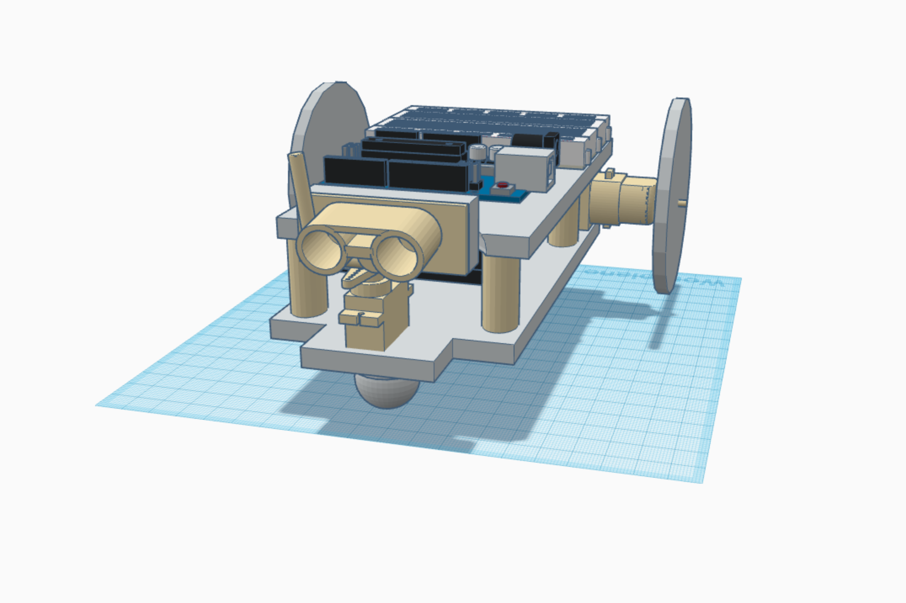

# Maze Solving Rover 

## Project Scope
In this rover project of Discovering Engineering course, we are asked to make a design of an automated rover capable of navigating through a maze using a sonar module to detect walls and avoid collisions. The rover follows programming from the onboard Arduino, receiving input from the sonar module, HC-SR04, to then decide whether the rover can move forward unobstructed or detect any walls that would prevent it from moving any further. The responses coded into the rover should allow it to complete a given maze without touching the walls with any part of the chassis.

As part of the design specification, we were restricted to use the provided components in the construction of the rover. These components include:

- An Arduino Uno Board

- Motor related: the SN754410 H-Bridge, 2 Micro Metal Gearmotors, 2 plastic wheels,

    a Ball Caster with a 1” plastic ball,

- Sensor related: the HC-SR04 sonar module, an 9G Micro Servo Motor,

- Other: batteries and wires to power the rover, a small breadboard,

    

With these components, we produced a rover with two engine-attached wheels that could be manipulated separately, along with a third wheel to hold up and balance the chassis and on- board components of the rover. With the provided components, we were able to create a list of design specifications the rover would need to fulfil and ensure completion of the given task within the given budget and time frame of the project.

## Video Footage 

The following video demonstrates how it solves a unknown maze and unknown maze via the onboard programs.

- https://www.youtube.com/watch?v=rdGnyssJCYY
- https://www.youtube.com/watch?v=A7F76DwvcQw
- https://www.youtube.com/watch?v=f40d9bLqAWQ

## Program Logic 

For a rover to successfully navigate through the maze, its programmed code can be divided into 4 phases:
1. Detecting the wall and stop
2. Detecting front wall type
3. (Optional) Detecting left/right wall difference
4. Making movement

**Phase 1:** The rover keeps moving forwards and keeps taking the sonar measurement at the 0° centre direction, until a close enough obstacle is detected, then proceed to phase 2. As one of the results from sonar assignment, that is: taking the median value from a normal distributed dataset, a more accurate and precise measure can be determined. Here, each measure is taken by using the median of five measurement, by doing this we trade off milliseconds level difference in respond time for a much higher accuracy and precision. This corresponds to the design specification 4,5 of "Sonar Performance".

**Phase 2:** Once a close enough wall is detected, the rover will detect the type of wall. In the assignment scenario given, we are facing 3 types of walls: wall perpendicular to rover’s moving path, wall that’s 45° clockwise and anticlockwise to the path. One difficulty we face is for the last two type of wall, the rover’s measure to it is always higher than actual; in another word, when entering from phase 1, the rover is actually already near touching the wall (≤2.0cm); and we know the sonar won’t get accurate measure under 2.0cm distance. Consequently, we program it to back off a little and turn the sonar sensors aligning it with the wall in order for more accurate measure.

**Phase 3:** After we know the wall type, we proceed to the next step. If normal wall then returns to the position where it backed- off from, measure distance to the closest left/right wall, and turn towards facing the one of longer distance, then reset to Phase 1. Otherwise, if 45° wall, play a programmed motion of turning 45° right or left, then reset to Phase 1

## Image / Screenshot

